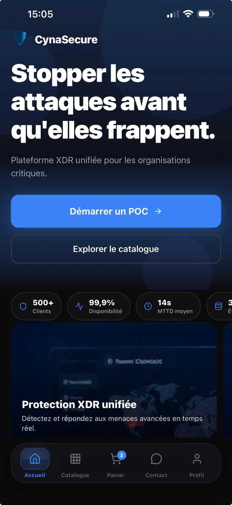
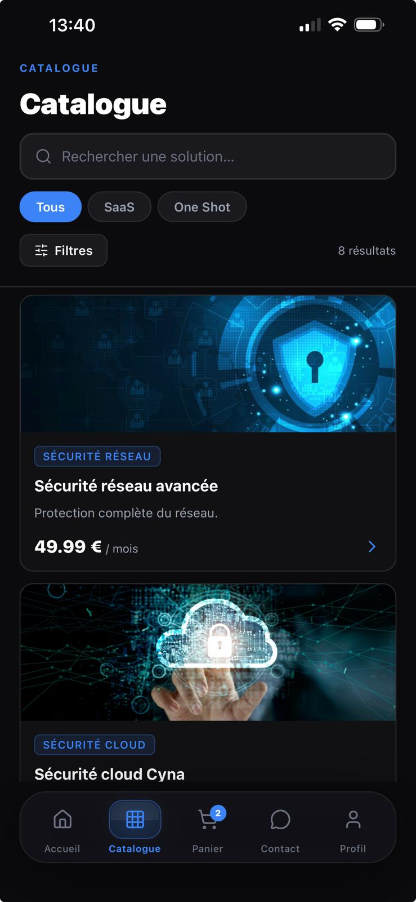
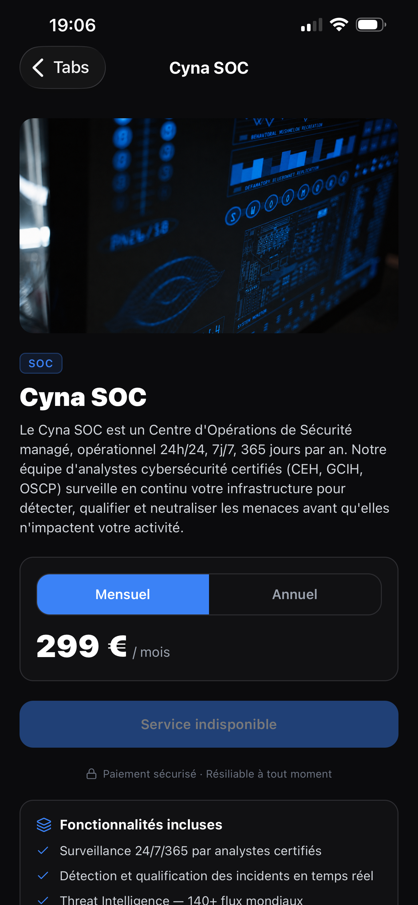
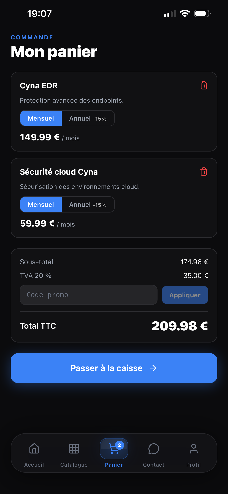
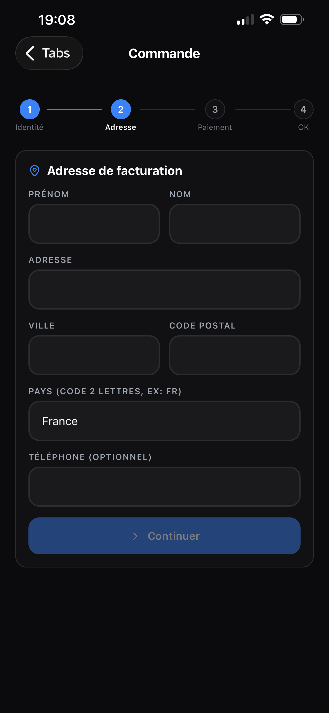
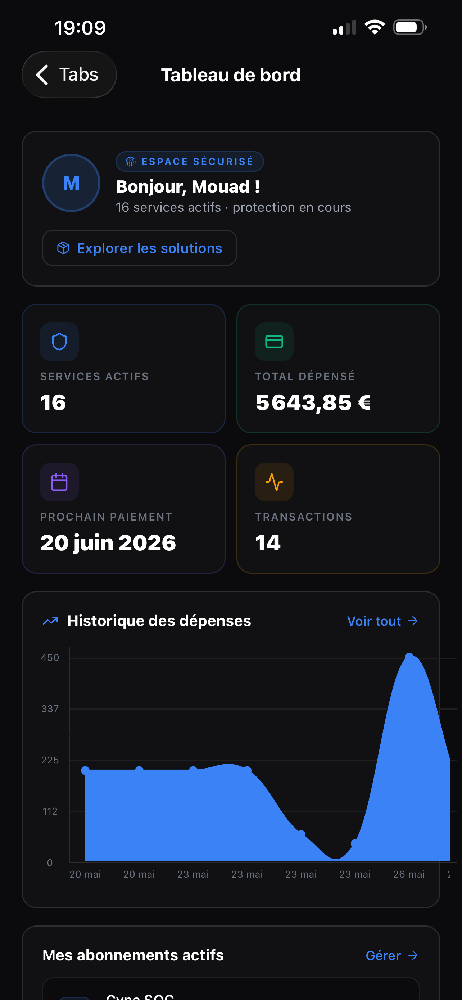
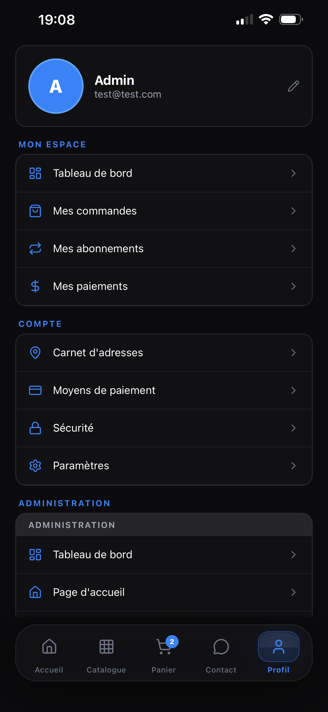
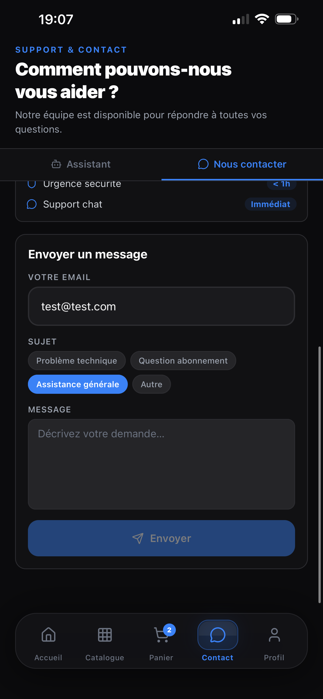
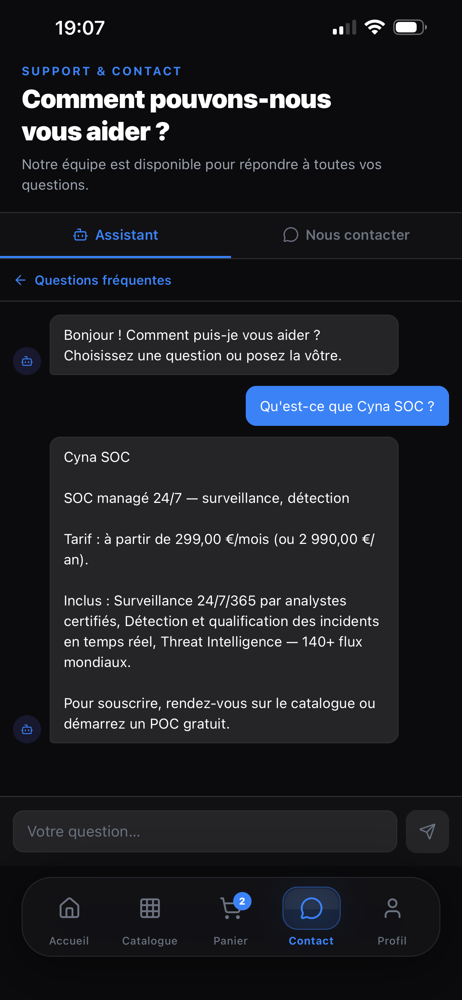
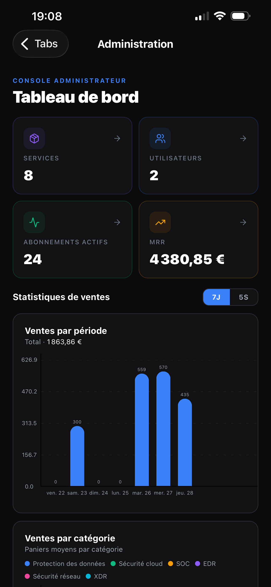

# Cynasecure Mobile

> Application mobile React Native (Expo), miroir du site web Cynasecure. Elle consomme la même API Symfony et la même base de données que le frontend web.


---

## Sommaire

1. [Aperçu](#aperçu)
2. [Stack technique](#stack-technique)
3. [Prérequis](#prérequis)
4. [Installation](#installation)
5. [Configuration](#configuration)
6. [Lancement](#lancement)
7. [Structure du projet](#structure-du-projet)
8. [Fonctionnalités](#fonctionnalités)
9. [Captures d'écran](#captures-décran)
10. [Connexion au backend](#connexion-au-backend)
11. [Build de production](#build-de-production)
12. [Dépannage](#dépannage)

---

## Aperçu

Cynasecure Mobile reprend l'intégralité des parcours du site web : catalogue, recherche, souscription d'abonnement, paiement, gestion du compte et back-office administrateur. Aucune logique métier n'est dupliquée : l'application est un client de l'API REST Symfony, au même titre que le site web.

<p align="center">
  
</p>

---

## Stack technique

| Technologie | Version | Rôle |
|---|---|---|
|  | SDK 54 | Toolchain et runtime |
|  | 0.81 | Framework mobile |
|  | 19.1 | Bibliothèque UI |
|  | 5.x | Typage statique strict |
|  | 7 | Navigation (Stack + Bottom Tabs) |
|  | 23 | Internationalisation (FR/EN/ES) |
|  | 0.50 | Paiement (mode test sandbox) |
| Lucide React Native | 0.45 | Icônes |
| AsyncStorage | 2.x | Persistance locale (panier, langue) |

---

## Prérequis

| Logiciel | Version |
|---|---|
| Node.js | 20 LTS |
| Watchman (macOS) | dernière (`brew install watchman`) |
| Xcode (iOS) | dernière |
| Android Studio (Android) | dernière |
| Expo Go (téléphone) | dernière (App Store / Play Store) |

Le backend Symfony doit tourner sur l'IP locale du poste de développement (pas `localhost`, qui pointerait sur le téléphone lui-même).

---

## Installation

```bash
cd mobile
npm install
```

---

## Configuration

Copiez `.env.example` en `.env` et remplissez les valeurs :

```bash
cp .env.example .env
```

```env
EXPO_PUBLIC_API_URL=http://VOTRE_IP_LOCALE:8000/api
EXPO_PUBLIC_STRIPE_KEY=pk_test_xxxxx
EXPO_PUBLIC_PAYPAL_CLIENT_ID=votre_client_id_paypal
```

Récupérer l'IP locale (macOS) :

```bash
ipconfig getifaddr en0
```

Le téléphone et l'ordinateur doivent être sur le **même réseau Wi-Fi**.

---

## Lancement

```bash
npm start
```

Trois options ensuite :

- scanner le QR code avec **Expo Go** (téléphone physique) ;
- appuyer sur `i` pour le **simulateur iOS** ;
- appuyer sur `a` pour l'**émulateur Android**.

En cas de cache corrompu :

```bash
npx expo start --clear
```

---

## Structure du projet

```
mobile/
├── App.tsx                  Point d'entrée (providers + navigation)
├── app.json                 Configuration Expo
└── src/
    ├── api/                 Clients HTTP par domaine
    │   ├── apiFetch.ts       Wrapper fetch + gestion des cookies de session
    │   ├── auth.ts           addresses.ts   checkout.ts
    │   ├── services.ts       subscriptions.ts   payments.ts
    │   ├── paymentMethods.ts contact.ts     home.ts
    │   ├── admin.ts          adminStats.ts
    ├── components/
    │   ├── ui/              Button, Card, Input, Badge, Loader, Skeleton, Toast
    │   └── shared/          ServiceCard, CategoryCard, SubscriptionCard
    ├── context/             AuthContext, CartContext
    ├── hooks/               useToast
    ├── i18n/
    │   ├── index.ts          Configuration react-i18next
    │   └── locales/          fr.json, en.json, es.json
    ├── navigation/          RootNavigator, MainTabs, navigationRef, types
    ├── screens/
    │   ├── Auth/            Login, Register, ForgotPassword, TwoFactor,
    │   │                    VerifyEmail, VerifyEmailChange
    │   ├── Home/            HomeScreen
    │   ├── Catalogue/       CatalogueScreen
    │   ├── Services/        ServiceDetailsScreen
    │   ├── Cart/            CartScreen
    │   ├── Checkout/        CheckoutScreen
    │   ├── Contact/         ContactScreen (formulaire + chatbot)
    │   ├── Legal/           LegalScreen (CGU, confidentialité, mentions, à propos)
    │   ├── Profile/         Profile, UserDashboard, MyOrders, MyPayments,
    │   │                    MySubscriptions, Addresses, AddressForm,
    │   │                    PaymentMethods, Security, ProfileEdit, Settings
    │   └── Admin/           Dashboard, Services, ServiceForm, Users,
    │                        Subscriptions, Payments, Contact, Promos, Home
    └── theme/               colors.ts (charte identique au web)
```

---

## Fonctionnalités

### Espace client
- Page d'accueil (carrousel dynamique, statistiques, top produits).
- Catalogue avec recherche temps réel, filtres et tri.
- Fiche service : pricing mensuel/annuel, caractéristiques, services similaires.
- Panier persistant (AsyncStorage) avec codes promotionnels.
- Tunnel de commande en 4 étapes (identité / invité → adresse → paiement → confirmation).
- Téléchargement des factures PDF.

### Compte utilisateur
- Tableau de bord, profil, édition.
- Carnet d'adresses, méthodes de paiement enregistrées.
- Mes abonnements (résiliation, changement de cycle, renouvellement auto).
- Historique de commandes groupé par année.
- Sécurité : double authentification TOTP.

### Authentification
- Connexion (« Se souvenir de moi »), inscription avec validation de mot de passe en temps réel.
- Vérification d'e-mail et changement d'e-mail par deep link (`cynasecure://`).

### Back-office administrateur
- Tableau de bord avec graphiques (ventes, paniers moyens, répartition).
- Gestion des services, catégories, utilisateurs, abonnements, paiements, codes promotionnels et contenu de la page d'accueil.
- Messages de contact et conversations chatbot.

### Transversal
- Multilingue FR / EN / ES (persistance locale).
- Toasts natifs, états de chargement (skeletons), pull-to-refresh.

---

## Captures d'écran

<p align="center">
  
  
  
  
</p>

<p align="center">
  
  
  
  
</p>

<p align="center">
  
  
</p>

---

## Connexion au backend

L'application utilise les **mêmes sessions Symfony** que le site web. La bibliothèque `@react-native-cookies/cookies` persiste le cookie `PHPSESSID` entre les requêtes.

Le backend doit autoriser l'origine de l'application dans sa configuration CORS :

```yaml
# backend/config/packages/nelmio_cors.yaml
nelmio_cors:
    defaults:
        allow_credentials: true
        origin_regex: true
        allow_origin:
            - '^http://localhost(:[0-9]+)?$'
            - '^http://VOTRE_IP_LOCALE(:[0-9]+)?$'
            - '^exp://.*$'
        allow_methods: ['GET', 'POST', 'PUT', 'PATCH', 'DELETE', 'OPTIONS']
        allow_headers: ['Content-Type', 'Authorization', 'X-Requested-With', 'Accept']
```

Pour vérifier que le backend est joignable depuis le téléphone, ouvrir dans son navigateur :
`http://VOTRE_IP_LOCALE:8000/api/services` (doit renvoyer du JSON).

---

## Build de production

```bash
# Installation EAS CLI
npm install -g eas-cli

# Configuration initiale
eas build:configure

# Build iOS (TestFlight)
eas build -p ios

# Build Android (APK / AAB)
eas build -p android
```

---

## Dépannage

### « Network request failed »
- Vérifier que le backend tourne et est joignable depuis le téléphone (`http://VOTRE_IP:8000/api/services`).
- Vérifier que les deux appareils sont sur le même Wi-Fi, sans VPN.
- Sur macOS, autoriser PHP dans le pare-feu (Réglages → Confidentialité et sécurité → Pare-feu).

### Erreur CORS
Vérifier que l'IP du téléphone est autorisée dans `nelmio_cors.yaml`, puis redémarrer le backend.

### EMFILE: too many open files
Installer Watchman : `brew install watchman`.

### Incompatibilité Expo Go
Aligner les dépendances natives avec le SDK installé :

```bash
npx expo install --fix
```

### Le panier disparaît au démarrage
Vérifier l'installation d'AsyncStorage : `npx expo install @react-native-async-storage/async-storage`.

---

## Statut

Application complète couvrant l'ensemble des parcours du site web (client et administrateur). Pistes d'amélioration prévues après la phase de tests : notifications push (Expo Notifications), mode hors ligne du catalogue, biométrie pour la connexion, Stripe PaymentSheet natif, soumission aux stores.
